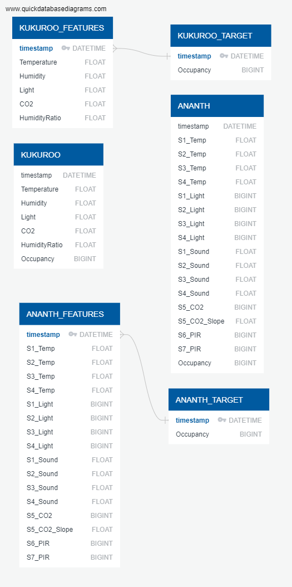

# Room Occupancy Detection

### Selected Topic 
   - Room occupancy detection for home or office using a variety of sensors such as temperature, motion, and humidity. Datasets from multiple experiments have been captured from Kaggle and the UCI machine learning datasets site.

### Reasons for topic selection 
   - The domain (whether people are in a room) is an easily understood and widely useful question. The type of analysis needed (binary classification) is one of the skills we learned in this course. There are multiple, well formed datasets available to the public on this topic. 
   - Potential use cases for occupancy detection include: 
     - Room cleaning after occupancy such as in clinics, conference rooms, and other public settings; particularly during the COVID pandemic.
     - Energy efficiency via room temperature management based on occupancy and turning off lights and other electrical devices.
   
### Description of Souce Data
   - Each dataset contains time series sensor telemetry from humidity, temperature, CO2, light and other sensors placed in a room. The data was collected both when someone is present in the room and when the room is not occupied. Each sensor reading is labeled with room occupancy ground truth and all sensors report their reading with a floating point value.  
   - Datasets are provided by Kaggle at these locations:
     - https://www.kaggle.com/kukuroo3/room-occupancy-detection-data-iot-sensor
     - https://www.kaggle.com/ananthr1/room-occupancy-estimation-data-set
     - https://www.kaggle.com/sachinsharma1123/room-occupancy
 
### Questions we hope to answer
   - Of the three datasets we selected, which one provides the best performance for accurate room occupancy detection?
   - What is the best occupancy detection performance that we can achieve given the available data using machine learning classification algorithms?
 
### Preprocessing the Data
   - Converted each dataset to include a binary outcome (0,1).
   - Renamed target values of datasets to be consistent with the other dataset and removed all object types from the datasets 
   - Preliminary features:
     - Telemetry data (C02, Light, Temperature, etc.) was used as features. 
     - Occupancy (binary outcome where 0 = No ; 1 = Yes) was set as target.

### Data Analysis
   - The data was split using the standard values for sklearn.model_selection's train_test_split (75 train / 25 test split).
   - Model choice is Random Forest algorithm from scikit-learn to analyze the data.
      - Pros:
        - Robust to outliers.
        - Works well with non-linear data.
        - Lower risk of overfitting.
        - Runs efficiently on a large dataset.
        - Better accuracy than other classification algorithms.
       - Cons:
         - Random forests are found to be biased while dealing with categorical variables.
         - Model is slow to train
         - Not suitable for linear methods with a lot of sparse features.

### Changes in Model
   - Revised column names to reflect the data we wished to focus on
   - Using the built-in Feature Importance of the RandomForestClassifier, we were able to identify the most important features for our model.
   - After identifying the significant feature, we re-ran the model testing the top feature alone then the rest of the features without excluding the top.

### Presentation Slides & Project Outline
The draft presentation - which also contains the project outline - can be found in in the link below.
   - https://docs.google.com/presentation/d/1osNFkS8d5RxEI2eKCFaoNMjgaGzFwkeNDIXmPj3grc8/edit#slide=id.g10d80d3b944_1_2

### Database Entity Relationship Diagram (ERD)

